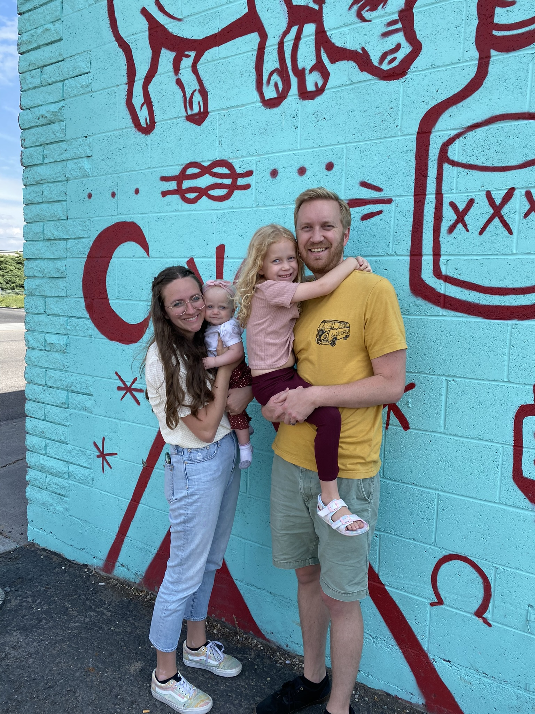



You guessed it, my name is Colin and I’m the author of this site. What more do you want to know? Throughout my life I've been known as someone who asks a lot of questions. As I've asked questions I've learned that not all questions have complete answers. For those questions without firm answers, I rely on my education, intuition, and simplifying assumptions to draw what I consider to be meaningful conclusions. 

<!--  -->

<figure class="gblog-post__figure">
    
    <figcaption>A picture of my family.</figcaption>
</figure>

I have a degree in Chemical Engineering from Brigham Young University. My training as a chemical engineer rekindled a childish sense of fascination for the world around me. I love finding new ways to use math, science, and computers to reason and attempt to explain observations in my life. I hope that you feel a similar sense of excitement and intrigue as you read my posts.

*A little more about me..*

**Engineer**

I have spent 7 years as a process engineer / data scientist in a manufacturing setting. During this time, I've worked in the semiconductor, carbon fiber composite, and pharmaceutical industries. As a process engineer, I frequently feel like a detective seeking out clues that ultimately lead to a discovery about an event either positvely or negatively impacting production. Every day I review data from a variety of sources, collaborate with operator and maintenance personnel, and physically troubleshoot equipment to come up with creative and efficient ways to reduce waste while creating a high quality products.

**Father**

I have a brilliant, beautiful, and patient wife and together we're raising 2 sweet and silly daughters. Experiencing the ups and downs of life together as a companionship is simultaneously a great joy and a challenging opportunity for reflection and personal growth (kids, am I right).

**Thinker**

I have a seemingly infinite capacity to ask questions. To me, this trait is distinct from my previous description as an engineer. I consider myself highly imaginative. Deep down inside, I literally believe that provided adequate resources any individual can conquer any problem. Most of my questions follow a common theme, how do things work and why are things the way they are? I entertain myself as I try to answer them.

