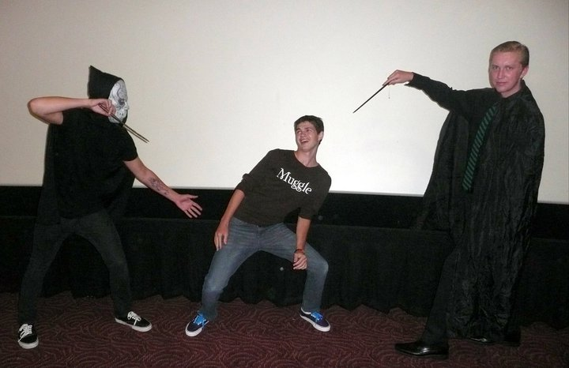
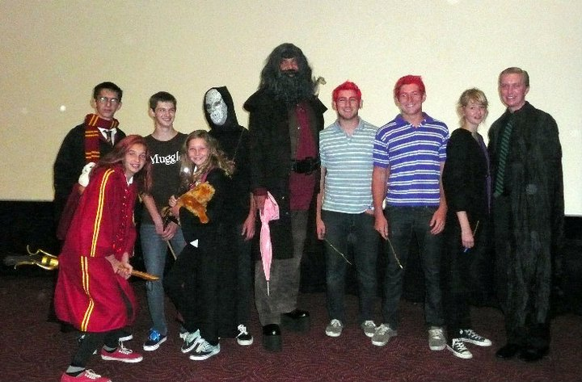
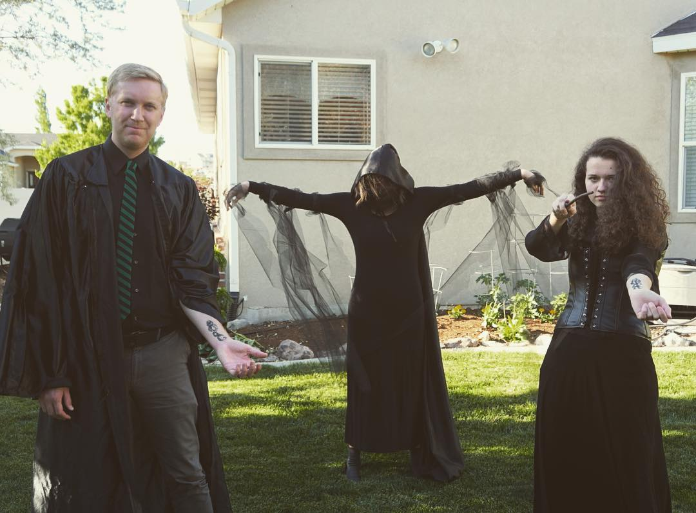
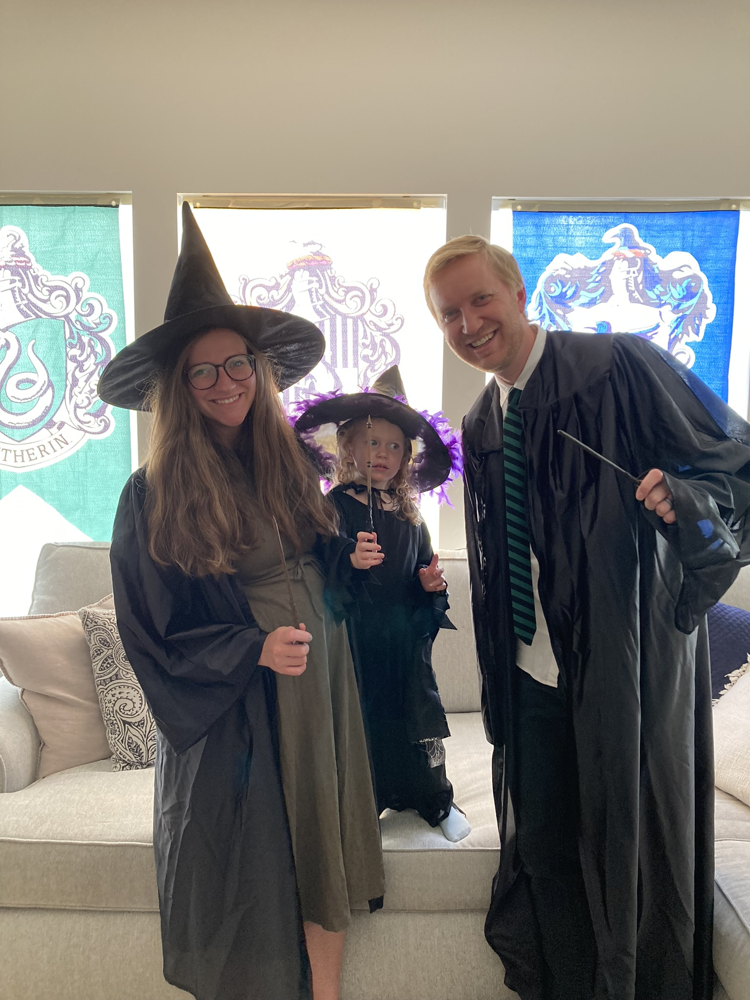
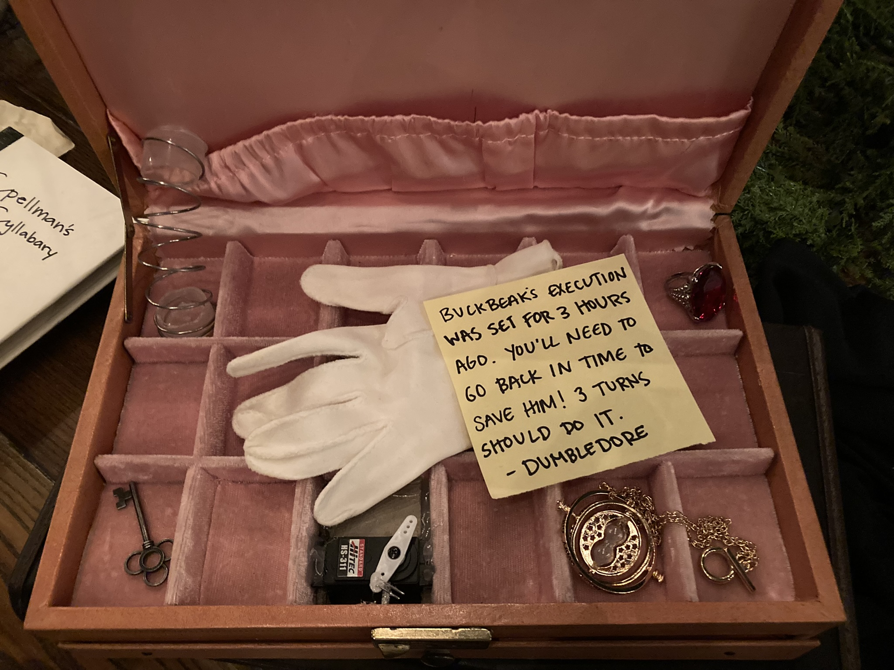

Happy Birthday, Harry!

I consider myself to be part of the Harry Potter generation. I was second in line, only behind my older sister, to read each book as it came out. By the time I got to high school, my friends and I would dress up as characters from the story and act out scenes in front of cheering crowds while they waited anxiously for the midnight movie premiers to begin.

### A little history...

<figure class="gblog-post__figure">
    
    <figcaption>High school me dressed as Draco Malfoy at a movie premier.</figcaption>
</figure>

<figure class="gblog-post__figure">
    
    <figcaption>The whole crew in Harry Potter costume.</figcaption>
</figure>

<figure class="gblog-post__figure">
    
    <figcaption>College me at a Harry Potter themed party.</figcaption>
</figure>

<figure class="gblog-post__figure">
    
    <figcaption>Dad me at yet another Harry Potter themed party.</figcaption>
</figure>

With that behind us, you'll understand that I was happy to oblige when a friend with their own Harry Potter traditions asked me to make a "magic" feature for an escape room that would be a central event at their annual Harry Potter party. Another important detail, this friend and their family go ALL OUT for their Harry Poter parties, every year on July 31st they host a HP themed party, the theme follows the order of a book in the series increasing each subsequent year.

### Feature Inspiration

I wanted to make a box that could be opened remotely when escape room participants cast the "Alohomora" spell. Sarah Jane found a beautiful antique jewelry box at a local thrift store that would provide the perfect aesthetic for the project. After redoing some sprinklers in the yard, I discovered that pop-up sprinkler springs were impressively strong and readily available. I knew I wanted to include a sprinkler spring as an energy source in the project.

<figure class="gblog-post__figure">
    <a href="images/IMG_2349.MP4">
        <video src="images/IMG_2349.MP4" 
            loop
            autoplay
            muted
            playsinline
            width="300">
    </a>
    <figcaption>Presenting, the Alohomora Box!</figcaption>
</figure>

To provide the energy to open the box, I mounted a spring in the back corner so that when the box closed, the spring would naturally compress pushing against the latched lid. I tuned the spring force by cutting the spring to a length that provided sufficient but not overwhelming force to flip open the lid when the box latch was opened. 

Next, I modified the jewelry box's latching mechanism so that it could be opened from the box interior. Then I attached a servo horn to the adapted mechanism.

Finally, I embedded an IR receiver and Arduino in an inconspicuous leather briefcase set beneath the peach colored jewelry box and wired everything together. When the correct spell was cast, the box would be triggerd by an escape room moderator revealing the clues hidden inside. 

<figure class="gblog-post__figure">
    
    <figcaption>A closer look at the mechanism.</figcaption>
</figure>

I am really proud of how nicely this box turned out. Besides functioning as designed, the aesthetics of the project are perfect. The box is still alive today and has been in multiple escape rooms for 2 years in a row.

<figure class="gblog-post__figure">
    <a href="images/IMG_2346.MP4">
        <video src="images/IMG_2346.MP4" 
            loop
            autoplay
            muted
            playsinline
            width="250">
    </a>
    <figcaption>First round of unsuspecting escape room participants.</figcaption>
</figure>

<figure class="gblog-post__figure">
    <a href="images/IMG_2347.MOV">
        <video src="images/IMG_2347.MOV"
            loop
            autoplay
            muted
            playsinline
            width="250">
    </a>
    <figcaption>Second round of unsuspecting escape room participants.</figcaption>
</figure>

