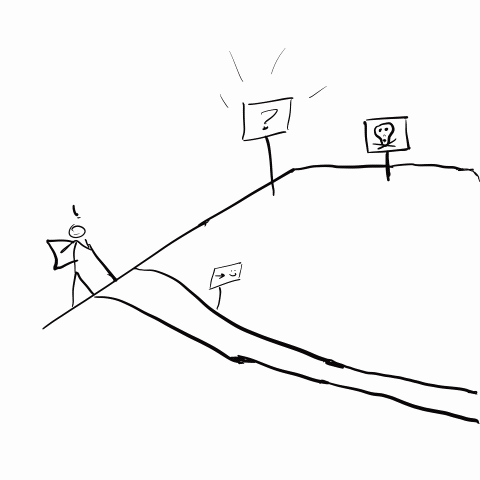

Earlier this week I noticed that our brown sugar had hardened making it difficult to use. Fortunately, dried out brown sugar can be rejuvenated by reintroducing moisture to the container. I'd heard that just a single slice of fresh bread has enough moisture to rehydrate a typical household supply of brown sugar. With this knowledge, I thought it would be interesting to weigh a slice of bread before adding it to the bag of brown sugar and then again after the sugar had softened to see if I could measure how much water had been exchanged between the bread and brown sugar.

| Initial Bread Weight  | Final Bread Weight | % Change |
| --- | --- | --- |
| 28.5 grams   | 24.5 grams  | -14% |

After about a week, I felt that the undisturbed system had reached equilibrium. What had previously been a fresh piece of bread now felt dry and crisp like a piece of toast while the coarse and hard brown sugar was once again soft and moldable. The moisture from the bread had transferred to the brown sugar. My kitchen scale showed that the bread lost 4 grams of water weight.

These measurements are specific to my "system" which is defined in part by my home's ambient conditions (temperature, pressure, humidity), the size and composition of the slice of bread I used, the amount and dryness of the brown sugar in my container, and the length of time that the system was allowed to equilibrate. Acknowledging these specific parameters means that while I expect you'd measure a similar exchange of moisture between a single slice of bread and roughly a pound of dried brown sugar, if you were to try the same experiment at home your exact measurements would likely vary from mine.

*There it is, I measured something! If you're satisfied, I'm glad you read this far and I hope that you learned something new. If you have more time, keep reading! This measurement triggered an interesting follow-up question.*

Consider what we just observed, brown sugar spontaneously absorbed moisture from a slice of bread. Brown sugar is more hygroscopic than the average food (in this case, bread). If you are unfamiliar with the term, hygroscopic is an adjective that describes the tendency of a substance to absorb moisture from air. Another familiar example of a hygroscopic compound is silica gel. You'll often find packets of silica gel packaged on the interior of various new objects. In these applicatioans, silica gel, which is more hygroscopic than brown sugar, serves as a desiccant; sucking moisture out of air to keep products fresh until they are opened. A desiccant is a hygroscopic substance that is used to induce or sustain a state of dryness. Technically, as we saw above, brown sugar could be used as a desiccant, however, after reading the rest of this post you'll learn that brown sugar's effectiveness as a desiccant would be limited in application. Understanding that brown sugar readily absorbs water from it's surroundings, **why did the brown sugar dry out in the first place?** 

<figure class="gblog-post__figure">
    
    <figcaption>An all too familiar sequence of events. You find yourself on a walk along a nice, safe path. "Huh? What's that? I'll go check it out... Wow, I've got to figure out what is causing that phenomenon! If I can just get a little closer. Aahhhhhh!!" Thermodynamics strikes again, tricked by a seemingly simple question you find yourself at the bottom of a dark cavernous pit.</figcaption>
</figure>

**The Set-Up**

To begin to answer my question, I started by revisiting the sequence of events that led to this experiment. At this stage, I tried to limit the story to indisputable facts.
- I bought a bag of brown sugar from the local grocery store. Initially, the sealed bag of brown sugar felt soft and moldable. 
- At first use, I transferred the brown sugar from its original plastic bag to a resealable plastic bag.
- Over a period of several months I opened the bag, removed an amount of brown sugar and subsequently closed the resealable bag of brown sugar.  
- Over time, the brown sugar dried into a hard, difficult-to-work-with mass. 
- I weighed a slice of fresh bread from a bagged-loaf purchased at the local grocery store, tore it into several large pieces and added it to the bag of dried brown sugar. 
- A week passed while the bag of bread and brown sugar was undisturbed and allowed to equilibrate.
- I removed the bread from the bag, brushed off the residual brown sugar, and weighed the bread again. 
- The texture of the brown sugar returned to it's soft and moldable state while the bread had become stiff and crisp.

**Simplifying Assumptions**

In order to start to infer some characteristics of the mechanism that caused my brown sugar to both dry out and rehydrate, I drew some simplifying assumptions that significantly reduced the complexity of the problem while maintaining enough detail to answer my question. 

I assumed...
- isothermal, the temperature was constant through out all events listed above. This is a reasonable assumption because the brown sugar was stored in the pantry of my kitchen where the temperature is held at 72 +/- 7 deg F year-round.
- closed system, the sealed bag of bread, air, and brown sugar, constitutes a closed system. Plastic bags are effective barriers to mass transfer. This is not a perfect assumption but over short time scales it is reasonable. Mass transfer through the walls of the plastic bag has a negligible magnitude when compared to the mass exchanged while the bag is open to the ambient atmosphere.
- During each opening of the bag, the ambient air in my home (which i'll consider as an infinite supply relative to the relatively small mass/volume of air in the closed bag system) was mixed with the air on the inside of the bag of brown sugar.
- Assuming brown sugar's moisture sorption isotherm can be accurately modeled with XXX which is publicly available on the internet

- Assuming brown sugar's water activity is 0.40 at 25 deg C and assuming the system in the unopened bag had reached equilibrium. The air in the headspace above the brown sugar is at 40% relative humidity (40% of the way towards dew point at 25 deg  C). the brown sugar system transitioned from an isolated system (no mass transfer to surroundings) to an open system (free mass transfer with surroundings). My house is kept at 30% relative humidity. Each time the bag is opened induced drafts from my arm scooping brown sugar out of the bag cause mixing between the two sources of air (brown sugar air and house air). When the bag is finally closed and stored back on the shelf the system is no longer in equilibrium (was at 40% RH and aw of 0.40). After mixing, the air in the headspace of the brown sugar bag is now at 32% relative humidity while the brown sugar is still at a water activity level of 0.40. This implies that the partial pressure of water in the headspace above the brown sugar is not high enough to prevent water molecules from permanently leaving the brown sugar. Thus the brown sugar preferentially gives up it's sorbed water to the air in the headspace of the bag. As this happens, the water activity drops and the relative humidity rises. They will meet somewhere between 32-40% RH and 0.32-0.40 aw. We can't say with certainty what the final aw will be because it is non-linear but we can be sure that the sugar will give up moisture to the air.   

<code class="has-jax">`\[a w = \frac{P_{vap}^*}{p_vap}\]`</code>

A little research led me to a tool that food scientists use when evaluating a processed food's (anything altered from it's natural state, i.e. a cut and wrapped chicken breast is a processed food article) shelf life. Moisture sorption isotherms depict the behavior of unbound/free water molecules in a given food item at varying ambient conditions. 

A moisture sorption isotherm can help provide clarity on brown sugar's hygroscopic behavior. It's reasonable to assume that brown sugar isn't some kind of mystical black hole, capable of infinitely absorbing water and drying out planet earth. There are limits to its hygroscopic ability, but just how much water can brown sugar absorb before becoming saturated and under what conditions will brown sugar preferentially release unbound water into it's surroundings? A moisture sorption isotherm can reveal the answers to these questions.

A moisture sorption isotherm plots the relationship between Moisture Content and Water Activity at a given temperature and pressure. 

-- get rid of this? -- Notice above in my first statement, I said a typical slice of bread and typical household supply of brown sugar. A piece of bread doesn't have a magic ability to rehydrate a truckload of brown sugar.

Clever food scientists use water activity, ratio of vapor pressures, to ensure that the properties of their food products are stable over time and a range of ambient temperatures so that consumers have a consistent pleasant experience each time they buy one. Not perfect but it buys time in the supply chain while goods are transported.

Why would a substance that sucks water from the air around it dry out? 

The short answer to my inquiry is water activity. Brown sugar has a fairly low water activity this means that it's equilibrium relative humidity is fairly low as foods go. Water activity of bread is around 0.95, this means that unless stored in an environment with 95% relative humidity the bread will progressively give up water content to the surounding air until equilibrium is met. Note that as the food substance gives up or gains moisture (at constant temperature) the system state slides up or down the moisture sorption isotherm towards a new equilibrium.    

Brown sugar is sort of like a composite material, it is composed of small solid crystals of white sugar that are enveloped in a thin layer of viscous, liquid molasses. The thin layer of molasses allows the coarse crystals to glide past one another and clump together. Both white sugar and molasses are natively hygroscopic but by some unknown means to many people on the internet, hygroscopic molasses can dry out, gradually increasing its viscosity until the sugar crystals eventually stick together in a hard mass. 

Some of my audience may be familiar with the concept of vapor pressure. Insert gif of how I visualize vapor pressure (the pressure required by the atmosphere to produce equilibrium mass transfer, high vapor pressure indicates a more volatile substance). Water activity is a common parameter used to explain the propensity of a food substance to harbor bacteria. Water activity is defined by a ratio of fugacities and can be simplified to a ratio of vapor presssures.

A quick Google search shows that there is not much in the way of freely available scientific literature about brown sugar's hygroscopic nature on the internet. There are more than a few articles about creative ways to rehydrate brown sugar, storage best practices, and others about substituting brown sugar in recipes that call for white sugar. My quest for knowledge and understanding was stymied. To make matters worse, none of my college textbooks (Thermodynamics, Separations, or Heat and Mass Transfer) even mention hygroscopicity, let alone brown sugar, in their indices. Because of this lack of available information I pivoted and adjusted my search vocabulary to focus on a material and characteristic that is supported by a much larger body of scientific literature, dessiccant silica gel. Pressure swing adsorption using activated carbon.

Water activity is directly related to vapor pressure of water in the subtance. At high enough relative humidity the brown sugar hangs onto the water but when the partial pressure of water the air falls below the vapor pressure of water in brown sugar thermodynamics forces water out of the hygroscopic material. It just so happens that for brown sugar, a weak desiccant this can happen at room temperature, for a strong desiccant like silica gel the vapor pressure is so low that it is unlikely to happen for a sustained period of time in normal ambient conditions.

Water activity is a pseudo vapor pressure of water divided by the vapor pressure of distilled water at the same temperature. Moisture sorption isotherm relates this to moisture content in the material % water per dry materials. If I multiply the activity by the pure water vapor pressure i can get the effective vapor pressure and then see what the partial pressure in the air is if the item is in equilibrium, if not in equilibrium then this will tell me whether it is absorb or desorbing water? If Pvap is below partial pressure of air then the food item will absorb water. Further investigation (wikipedia) helped me understand why we use water activity, the water activity is the same as the equilibrium relative humidity. Because at equilibrim, pure distilled water will have a relative humidity of 1, we will saturate the air with the water that is available at that temperature. When we introduce hydrogen bonds and capillaries that water now tends to hang out on the surface or interior of the food rather than in the air.

Chemical engineers will remember learning about activity coefficients (chemical potential, internal energy, gibbs free energy and fugacity). Effective concentration, so we can still think of concentration gradients but now we consider molecular interactions impacting concentration gradients. When activity across two phases is the same the phases are in equilibrium.

<!-- 
how does hygroscopic activity present itself, so at some moisture levels the sugar sucks water from the atmosphere but if its dry enough the air sucks water back out? Ziploc bag method has less headspace above the sugar to be exchanged each time the container is opened to the atmosphere. Heating it is only for immediate use because you are actually driving more moisture out and probably only changing the viscosity of the molasses.
- Though we may not see it, the materials around us are dynamic systems. They move towards equilibrium.
- Everytime the bag is opened, the boundaries on the closed system are broken and the system opens up to mass transfer. The solid brown sugar remains in the bag but the mixture of gasses in the atmosphere are free-flowing and exchange with some of the gasses in the room that the bag is opened into. Unless the ziploc bag is opened up in a room with very high humidity, this acton leads to a net loss of water in the closed system.  (create gifs in concepts.app)
- The addition of the sliced bread introduces free water back into the closed system, re-establishing a concentration gradient. The air gets humidified to a point where there is enough water that the sugar actually absorbs it from the air. 

Because of the measurements collected during my experiment, I'm not able to answer more specific questions like: how quickly did the mass transfer happen, or how much water was left in the bread, how much water could the brown sugar have absorbed before becoming saturated. If I wanted more details I would have had to take more measurements. How much brown sugar did I start with, how dry was it really, how much bread did I start with, how much moisture was available to be transferred? What temperature did I run the experiment at?

Brown sugar as a desiccant, couldn't use a pouch, would need a large bag, could only serve to reduce the humidity over a very small interval before the moisture sorption isotherm changes not very practical but technically it could work.

 -->
