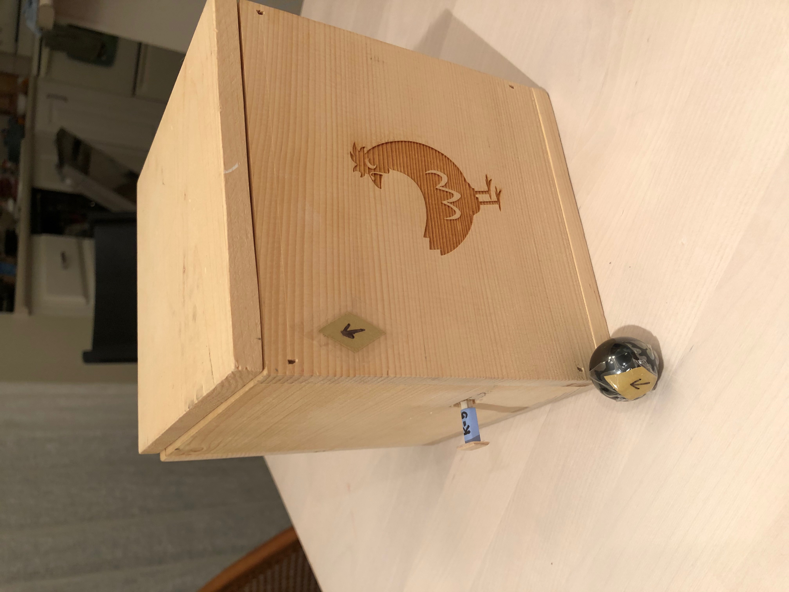
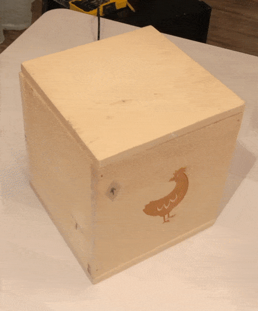
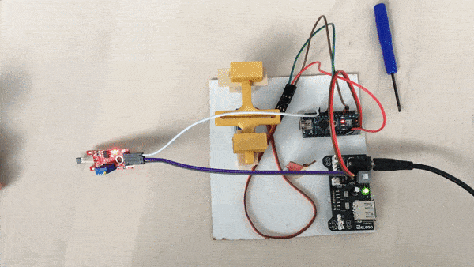
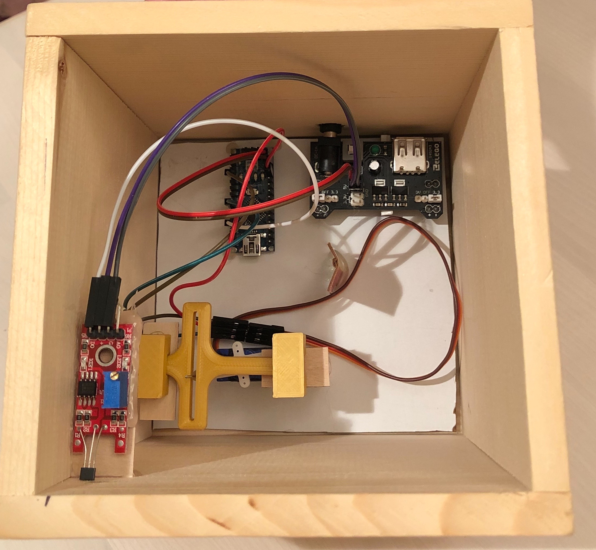

<figure class="gblog-post__figure">
    
    <figcaption>When presented with a magnetic field, a small post protrudes out of the side of this wooden box to reveal a hidden clue.</figcaption>
</figure>

Recently I created a feature for a private escape room birthday party. I called my creation the diversion box. The box itself is pretty inconspicuous. Though boxes tend to contain or conceal objects, this box was never meant to be opened. Instead, when presented with the correct key, the box ejects a subtle clue that unlocks further progress in the escape room.

<figure class="gblog-post__figure">
    
    <figcaption>I present the Diversion Box!</figcaption>
</figure>

The mechanism on the interior of the box is composed of an Arduino Nano, a small SG90 servo motor, a linear hall effect sensor, a power supply, and a 3D printed scotch yoke that I modeled in Fusion360. 

<figure class="gblog-post__figure">
    
    <figcaption>Operation of the mechanism inside the diversion box.</figcaption>
</figure>

During operation, the Arduino Nano microcontroller operates as a state machine. The controller begins by polling a digital input connected to the hall effect sensor waiting for a 5V signal. The hall effect sensor is tuned to detect whether a magnet is near (more than near, the polarity of the magnetic field, corresponding to the orientation of the magnet is a critical component of detection), at which point it presents a 5V signal to the Arduino. 

After the input signal is received, the Arduino compares its current state, either clue presented or clue hidden, against the proposed state, clue presented. If the device is not in the clue presented state, a digital output signal is sent to the servo motor to rotate into the position corresponding to the clue presented state. 

The clever scotch yoke mechanism converts the rotational motion of the servo motor into a linear sliding motion and the clue is pushed out of the box. If the Arduino were already in the clue presented state, no transition is necessary and the loop continues. When the magnetic field is no longer present, the hall effect sensor's digital signal switches from high (5V) to low (0V). In response to this signal change, the Arduino recognizes a state transition and commands the motor to retract the clue.

<figure class="gblog-post__figure">
    
    <figcaption>A view of the interior of the diversion box. A power supply distributes 5V to the Arduino Nano, SG90 servo motor, and hall effect sensor. The Arduino Nano listens for signals from the hall effect sensor and sends signals to the servo motor.</figcaption>
</figure>

I modeled the hardware layout in Fusion360 and then mounted the components on a sheet of cardboard that I could lower into the box to keep things organized. Though not visible in these pictures or videos, after completing the box I screwed the lid into place to prevent it from being opened during the party. This was a fun little project, I hope you enjoyed reading about it!