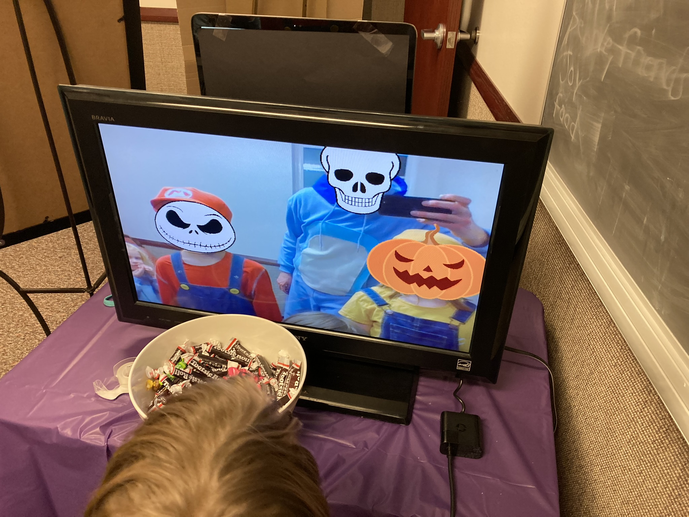

I wrote a fun Python script leveraging an open source pose estimation model to overlay masks on top of faces identified in a webcam feed. Pose estimation describes a subset of deep learning models whose objective is to label human features within an image. Given a photo or video input, a pose estimation model returns the coordinates for landmarks representing specific human body parts within the input.

<figure class="gblog-post__figure">
    
    <figcaption>A screenshot of the deployed script overlaying Halloween masks on top of partygoers faces.</figcaption>
</figure>

The high level pipeline I implemented was: 
<ol>
<li> Capture a frame from my laptop's webcam feed (OpenCV)
<li> Perform some color pre-processing
<li> Identify landmarks representing face features (MediaPipe)
<li> For each identified face:
<ul>
    <li> Select a Halloween mask from a previously compiled list of jpegs
    <li> Resize the jpeg based on the size of the detected face
    <li> Overlay the resized jpeg mask on the face in the captured frame
</ul>
<li> Post-process by flipping the modified frame to present a selfie/mirror view
<li> Stream the processed frame to the TV 
</ol>

<figure class="gblog-post__figure">
    <a href="images/Stabilize_Face_Swap.MP4">
        <video src="images/Stabilize_Face_Swap.MP4" 
            loop
            autoplay
            muted
            playsinline
            width="350">
    </a>
    <figcaption>A webcam video feed where Halloween caricatures have been swapped in place of detected faces in the frame.</figcaption>
</figure>

A challenge that I didn't expect to encounter during this project was establishing continuitiy between video frames. I have a set of 6 masks that can be overlayed, at first, the mask assigned to a face would switch from one frame to the next (see below). While there are many clever ways to address this, I implemented a quick solution by sorting the detected faces based on their coordinates and applying the mask corresponding to the sorted index.

<figure class="gblog-post__figure">
    <a href="images/IMG_3692.MP4">
        <video src="images/IMG_3692.MP4" 
            loop
            autoplay
            muted
            playsinline
            width="300">
    </a>
    <figcaption>After figuring out resizing of masks, the next hurdle I faced was overlaying the same mask on each face from one frame to the next.</figcaption>
</figure>

If I were to circle back to this project, during my next iteration I would devote more time to smoothing the transitions from one frame to the next. In its current state, subtle changes in bounding box size create a jumpy effect as masks are resized to fit each face. Another neat feature would be adding logic to detect a gesture, like a nod of the head, and changing to a new mask in response. Hope you enjoyed reading about this! I have used pose estimation in several other projects that will hopefully be documented soon! 