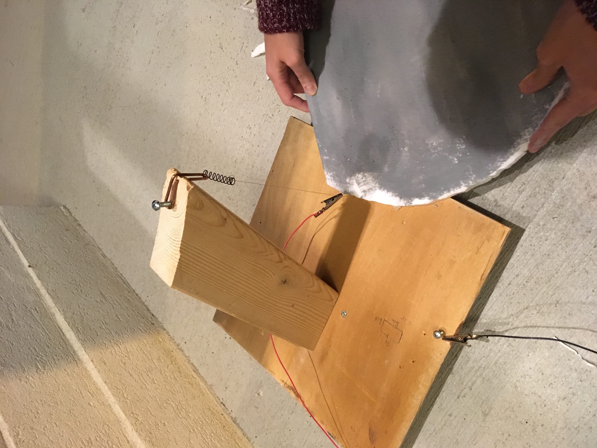

Sarah Jane had a clever idea to repurpose some styrofoam from the packaging of a recent IKEA furniture purchase in some Halloween decorations. I thought I could impress her by making a foam wire cutter to help her make some nice clean cuts. Did I mention I started and finished this project in one night?

Nichrome wire is super cool (at least I think so, but who are you to judge, this is my blog). Resistance or joule heating describes the process of a material's temperature rising as an electric current flows through it. Unlike copper wire which conducts electricity with very low resistance, Nichrome wire is intentionally chosen for its high resistivity (resistance per length) in designs that are looking to convert electricity directly into heat.

I tensioned some Nichrome wire between a screw and a tensioned spring so that when the wire heats up and expands, the spring compresses and pulls the wire tight again. The wire was mounted to a flat sheet of wood and a 2x4 anchored at an angle to provide clearance for foam to be cut.

<figure class="gblog-post__figure">
    <a href="images/IMG_4499.mov">
        <video src="images/IMG_4499.mov" 
            loop
            autoplay
            muted
            playsinline
            width="300">
    </a>
    <figcaption>Cutting foam like butter...</figcaption>
</figure>

I supplied the wire with electricity via a pair of alligator clips just above and below the working surface. Besides being easy to remove when I stow this project in the garage, alligator clips ended up being a great choice because they are super easy to adjust. 

While cutting foam, wire temperature is critical. You need a hot enough temperature to start cutting and after that your cutting speed is limited by how much wattage you can replace in the wire. I used a fixed voltage DC power supply, remember we're making decorations from trash... I'm reasonably frugal and at this point though I wanted one, I hadn't purchased a laboratory DC power supply. 

With a fixed voltage, the only way I could control temperature was by varying the resistance in the circuit. In other words, I could move the alligator clips further apart to increase resistance and decrease the total current (and wattage as a result P=IV) thus lowering the wire temperature, or I could bring the alligator clips closer together to decrease the resistance, increase the current/wattage and wire temperature. 

Keep in mind, there are certainly safety hazards to be aware of with this design choice. We did a pre-job hazard assessment (PJHA, no really, I do this regularly when working on cars and other projects at home) and were aware of the risks while operating. This was a temporary tool and we were using a 7V power supply.

<figure class="gblog-post__figure">
    
    <figcaption>Quick and DIY wire foam cutter.</figcaption>
</figure>

