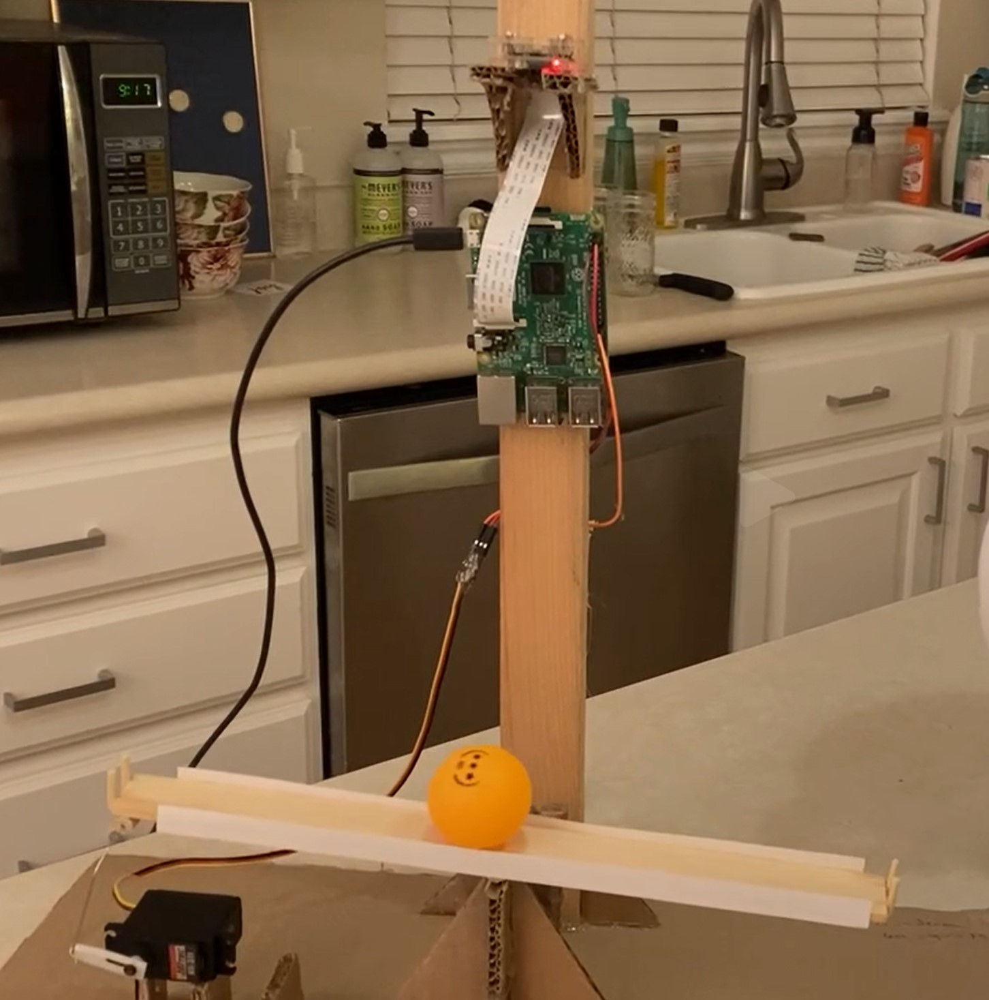
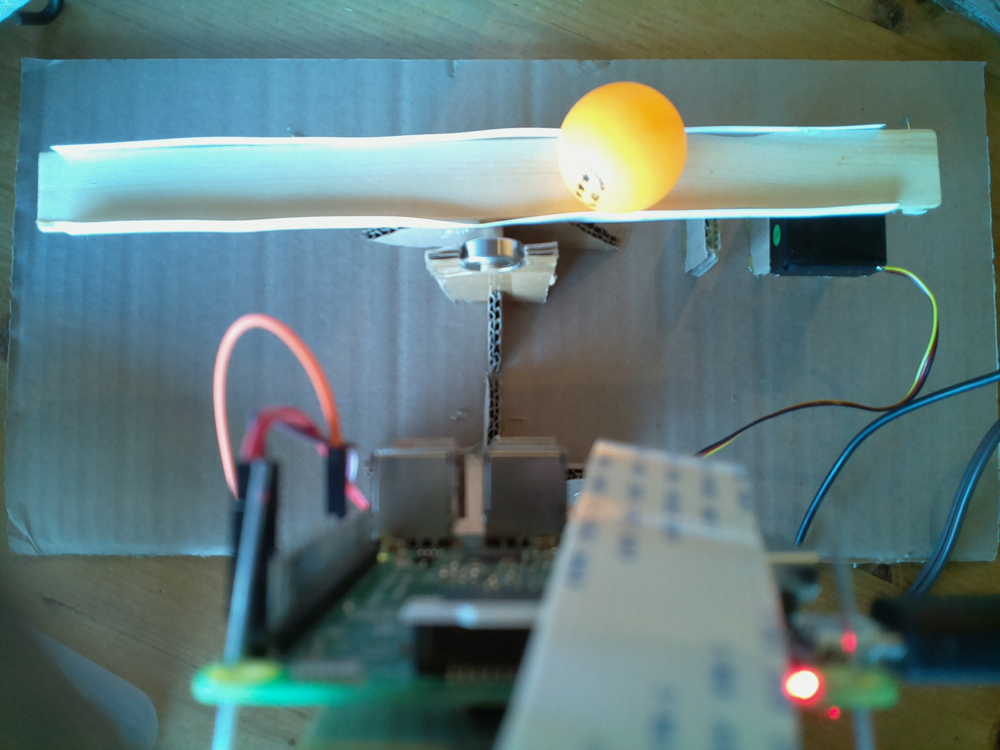

I love process control and automation. PID controllers are a simple and intuitive abstraction that allow for feedback control.
<ol>
<li> take action
<li> monitor state
<li> take error-corrected action
<li> repeat steps #2 and #3
</ol>

A classical example of control is the 1-dimensional ball-on-beam problem. The objective is to balance a rolling ball at a specific point on the beam. I wanted to mess around with computer vision and PID control so I bought a $15 PiCamera and dusted off my Pi 3B+ and got to work.

<div class="flex justify-center">
<figure class="gblog-post__figure">
    <a href="images/full-apparatus.jpg">
        
    </a>
    <figcaption>The full apparatus.</figcaption>
</figure>
</div>

I literally built the structure out of cardboard, a paperclip, one ball bearing, 3 pieces of scrap wood (a 1x2, a dowel rod, and a paint stirrer), paper, and hot glue. 

The control system is composed of a RaspberryPI 3B+, a 5V servo motor, and a PiCamera. 

<div class="flex justify-center">
<figure class="gblog-post__figure">
    <a href="images/IMG_0368.MP4">
        <video src="images/IMG_0368.MP4" 
            loop
            autoplay
            muted
            width="700">
    </a>
    <figcaption>Critically damped ball on beam.</figcaption>
</figure>
</div>

During operation, the RaspberryPi runs a custom python script that I wrote which loops over the following processing pipeline:
<ol>
<li> Acquire image
<li> Pre-process image (crop, and color subtraction)
<li> Ball detection
    <ul>
    <li> Canny edge detection
    <li> Hough circle transform
    </ul>
<li> Extract location of ball center
<li> Calculate error and integrated error
<li> Calculate PID output (implemented anti-reset windup and angle limits)
<li> Map angle to servo PWM signal
</ol> 

<div class="flex justify-center">
<figure class="gblog-post__figure">
    <a href="images/test_frame_ball.jpg">
        
    </a>
    <figcaption>View from the PiCamera.</figcaption>
</figure>
</div>

I remember being stumped by jittery or choppy servo motion. After some research I learned that I needed to run ```sudo pigpiod``` to start the Pi GPIO daemon before executing my script in order to get smooth PWM motion out of the servo motor. 

In the end, while I was able to produce examples which suggested I was close to a tuned controller with critically damped behavior, many runs still resulted in oscillations. If I were to continue working on this tuning problem, I would investigate the consistency in image acquisition and processing. I suspect that irregular loop timing may be the root cause of the issues I had achieving consistent optimal control.