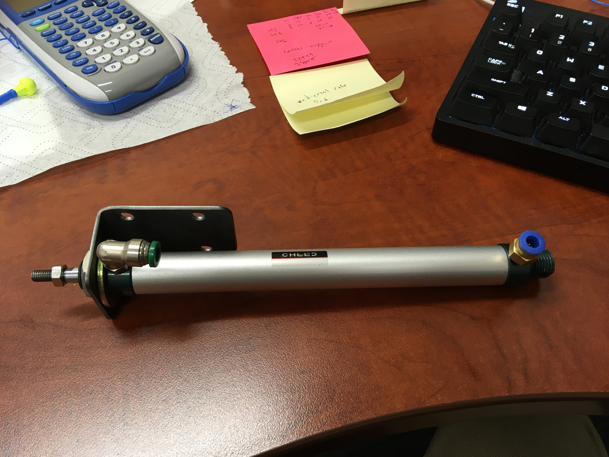
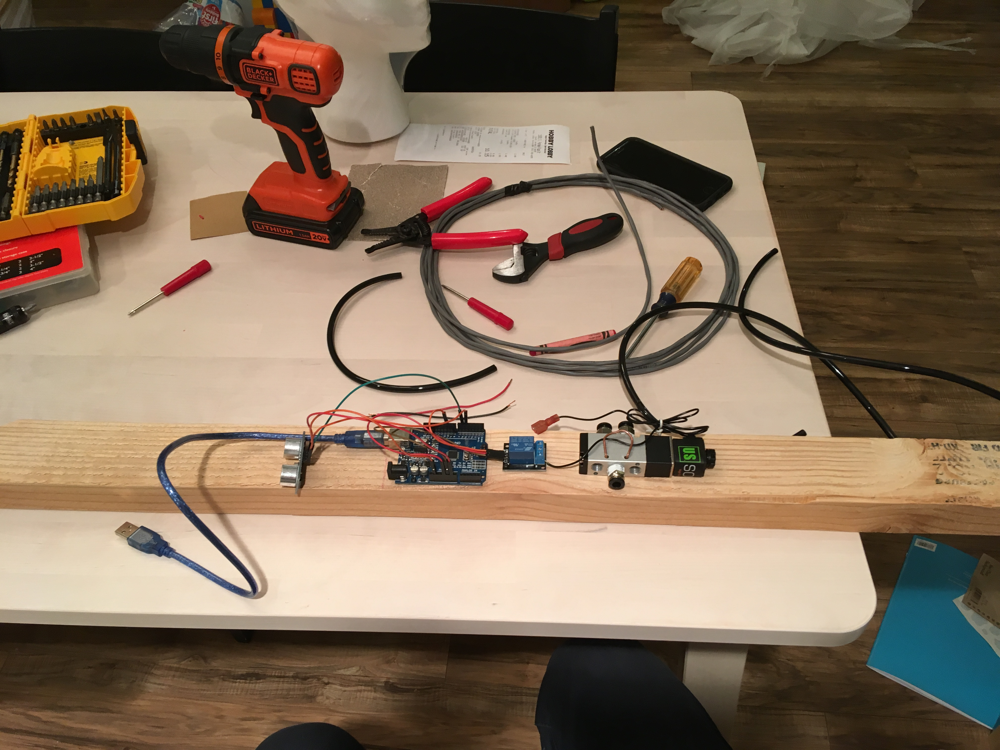

We moved recently and I have some fresh motivation to make something fun. I had a cheap pneumatic cylinder and solenoid valve that I thought would provide the perfect mechanism for a pop-up decoration to scare trick-or-treaters on our porch.

<figure class="gblog-post__figure">
    <a href="images/pop-up-bust-demo.mp4">
        <video src="images/pop-up-bust-demo.mp4" 
            loop
            autoplay
            muted
            width="300">
    </a>
    <figcaption>Passive infrared (PIR) triggered pneumatic Halloween decoration!</figcaption>
</figure>

Besides attaching a styrofoam bust to a pneumatic cylinder without it launching off, the hardest part about this project ended up being the trigger mechanism. At first I thought I could trigger the solenoid valve using an ultrasonic transducer (measures distance by the time-of-flight of reflected sound waves) but quickly found that I would need to do some complicated filtering to get rid of noise from using the sensor outside on a porch while leaves blew around and cars passed by on the street. 

After fiddling for many hours, I ended up abandoning the ultrasonic transducer in favor of a passive infra-red sensor (the kind that triggers the light on your garage door motor). Which had a simple trimpot to adjust the sensitivty of the triggering IR intensity. This was a lot more stable of a solution, I have another project in mind for the transducer.

Unfortunately, I don't have many pictures of the build process for this one. It was a pretty straight-forward hardware set-up, air compressor provides pressure to the solenoid valve via a hose and quick-connect fitting. Then pressure is suppleid from the solenoid valve to the pneumatic cylinder via some pneumatic tubing. The solenoid was actuated by the Arduino when the PIR sensor output a 5V signal indicating someone was present.

<figure class="gblog-post__figure">
    
    <figcaption>Pneumatic cyclinder and mount.</figcaption>
</figure>

<figure class="gblog-post__figure">
    
    <figcaption>Mounting the Arduino and solenoid valve.</figcaption>
</figure>

