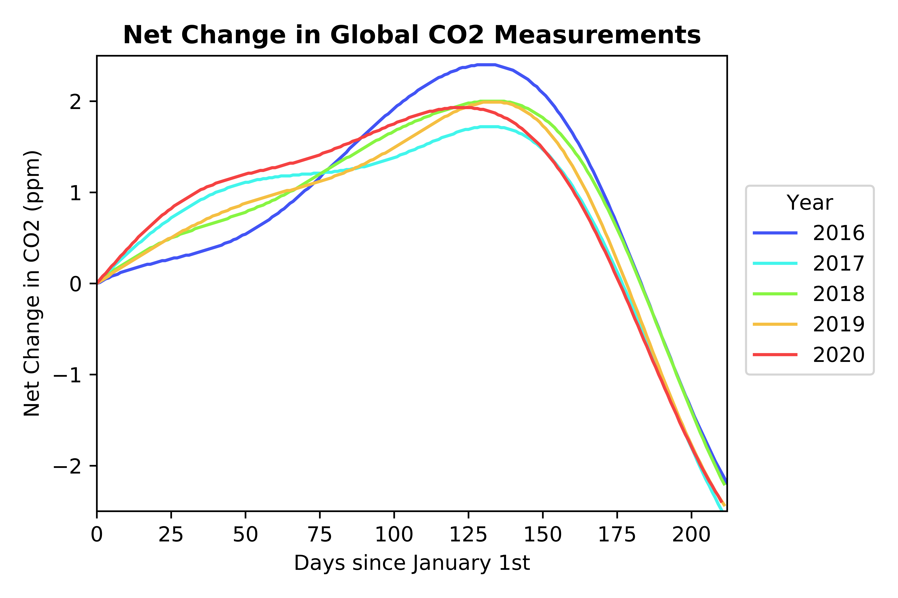


<!--more-->
hihi

<figure class="gblog-post__figure">
    <video
            src="images/Thermo_MP4.mp4" alt="Test this?" controls="controls">
    </video>
    <figcaption>An all too familiar sequence of events.</figcaption>
</figure>

Shortcode notation, see layouts>shortcodes>img 
Inside of that shortcode html file we have div classes that specify center justification and grey background
I think that re-scaling the .png is causing the change in quality

was  size="tiny">}}